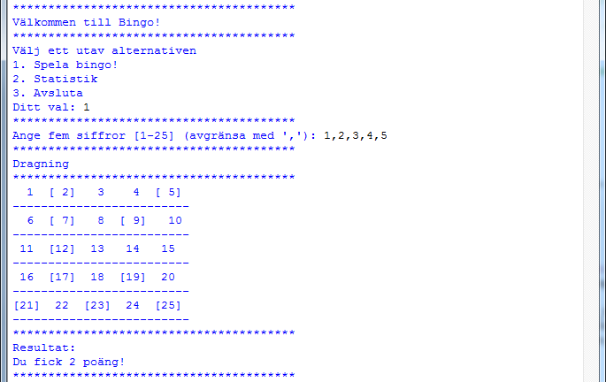

# Inlämningsuppgift 3

## 1. Introduktion

Denna inlämningsuppgift har som syfte att examinera modul 4 som har fokus på listor.

Inlämningsuppgiften är individuell. Det betyder att studenten enskilt ska utforma och skriva sin inlämning samt kunna redogöra för alla delar av den. Det är så klart inte förbjudet att diskutera uppgiften. Men viktigt är alltså att det man lämnar in representerar ens egna arbete.

## 2. Uppgiftsbeskrivning

Uppgiften går ut på att vi ska bygga ett spel, likt Keno, fast i en lite mindre variant. Spelet ska ha följande struktur:

- En meny där man kan välja att spela bingo, visa statistik, eller att avsluta programmet
- Bingo
    - Användaren blir ombedd att ange fem siffror mellan 1 och 25. Ni kontrollerar så att användaren:
            - angett exakt fem siffror
            - att alla siffrorna är korrekta (mellan 1 och 25),
            - att det inte anges några dubeletter av siffror
            - *annars ber ni användaren att ange fem nya siffror*
    - Dragning: Ni slumpar fram 10st tal mellan 1 och 25 som ni sedan presenterar för användaren i en utskrift, i form av en spelplan. (Se exempelkörning nedan - dock behöver din presentation inte se *exakt* likadan ut.)
    - Resultat: Resultatet av dragningen (antal rätt) presenteras för användaren
- Statistik
    - Användaren kan se sina resultat från tidigare spel

### Exempelkörning

## Tips

Det kan vara en god idé veta hur man göra en sträng till en lista genom funktioner `split()`. Se t.ex.

# Gör om en sträng till en lista genom att splitta strängen genom " " (ett mellanslag)
my_string = "Jag heter Anton"
my_list = my_string.split(" ")

print(my_list) # Skriver ut ["Jag", "heter", "Anton"]


Det kan även vara bra att veta hur man göra om en lista med strängar till en lista med nummer. Det kan man göra genom följande kod:

numbers_as_string = ["1", "2", "3"]
numbers_as_int = [int(i) for i in numbers_as_string]
# numbers_as_int är: [1, 2, 3]


## Bedömning

Uppgiften kan ge betyget väl godkänt.

### För G

För att nå betyget godkänt behöver programmet uppfylla uppgiftsbeskrivningen, vara välstrukturerat och väldokumenterat. Extra viktiga punkter är:

- Koden ska vara strukturerad med ett antal funktioner, där varje funktion har begränsat syfte och omfattning
- Koden ska vara tydlig och lättläst med avseende på namngivning, strukturering och kommentarer. Funktioner som inte är självförklarande ska ha en beskrivning i form av _docstrings_ (`''' Kommentar för funktionen '''`-kommentarer).

### För VG

För VG ska ni även implementera möjligheten att spela mer än en spelare per omgång.

- Man ska kunna ange flera gissningar per omgång (en per spelare)
- Man ska kunna se alla spelares resultat efter spelad omgång
- Under *statistik* ska alla spelares statistik visas

Ni ska använda er utav en lista för att spara spelarna.

### Specifika krav för uppgiften

- Ni ska spara användarens val av siffror i en lista (tips, använd funktionen `split()` för att skapa en lista av användarens val)
- Er spelplan (som används vid presentation av dragningen) ska representeras av en nästlad lista (storlek: 5 * 5).
- De nummer som dras i varje dragning ska sparas i en lista
- Statistiken (antal poäng) för tidigare spel ska sparas i en lista
- Även kvalitén på er kod kommer att bedömas.

### Detta testas vid rättning

Det här är en kort lista över delar som kommer att testas under rättningen. Får ni rätt på det här brukar uppgiften kunna godkännas utan kompletteringar.

1. Körning av programmet
2. Inmatning av tal som är större än 25 och mindre än 1
3. Inmatning av annat än heltal
4. Inmatning av både färre och fler siffror än fem
5. Inmatning av två eller fler lika nummer
6. Flera körningar för att testa slumpmässigheten
7. Alla val i menyn
8. Ej giltiga menyval

För VG-delen kommer ytterliggare test på den extra funktionalitet som tillkommer (+ den ovan)

9. Lägga till flera spelare
10. Varje spelare ska få gissa vars en gång per runda
11. Statistikdelen ska visa alla spelares resultat per runda

[Här kan ni se en exempelkörning av VG-delen](images/result_vg_bingo.png)

## Redovisning

Redovisa genom att ladda upp programmets källkod på It's Learning.

Inlämningsuppgifter rättas varje vecka, med fredag som rullande deadline. Försök att hålla kursens tempo på en modul per vecka. Lämplig inlämningstid för modul 4: senast _onsdag, 2016-12-14_.
