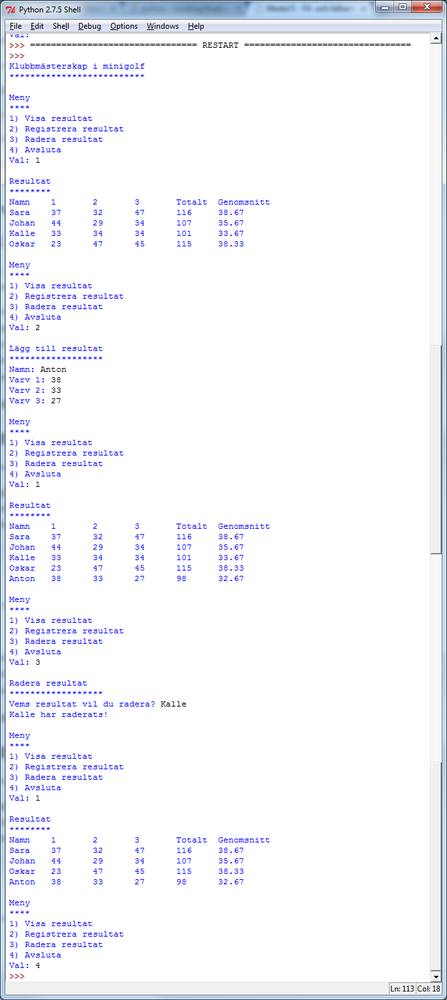

# Inlämningsuppgift 4

## 1. Introduktion

Denna inlämningsuppgift har som syfte att examinera modul 5 som har fokus på fil- och felhantering.

Inlämningsuppgiften är individuell. Det betyder att studenten enskilt ska utforma och skriva sin inlämning samt kunna redogöra för alla delar av den. Det är så klart inte förbjudet att diskutera uppgiften. Men viktigt är alltså att det man lämnar in representerar ens egna arbete.

## 2. Uppgiftsbeskrivning

Vi ska i denna uppgift bygga en resultathanterare för en minigolftävling. Minigolftävlingen går ut på att varje person spelar tre varv (rundor) och det totala antalet slag avgör vem som vinner. Programmet ska kunna spara registrerade resultat till en textfil, och läsa in tidigare resultat från filer som följer samma format.

För att spara resultaten finns två alternativ, fria att välja mellan. _Alternativ ett_ är att spara med följande struktur:


namn;varv1;varv2;varv3;
namn;varv1;varv2;varv3;
namn;varv1;varv2;varv3;


För alternativ ett finns en exempelfil att utgå från (med några förinlagda resultat) [här](result.txt).

_Det andra tillåtna alternativet_ är att använda något av de inbyggda biblioteken för serialisering, i form av `pickle` eller `json`.

Programmet i sig ska ha tre funktioner:

1. Visa resultat för spelarna
	- Här ska spelarens namn, resultat för varje varv (total 3st resultat), totalt antal slag, och genomsnittsslag per varv presenteras
2. Registrera resultat för en ny spelare
	- Här ska man ange namn och resultat för varv 1,2,3
3. Radera en spelare (och dennes resultat)
	- Här anger man namnet på den spelare som man vill ta bort från resultatlistan

Ni får själva avgöra om ni vill läsa/skriva till filen varje gång ni kör någon av funktionerna ovan, eller om ni vill göra en "spara" och en "hämta" funktion som läser/skriver till filen.

### Exempelkörning

## Bedömning

Uppgiften kan ge betyget godkänt. För att nå detta betyg behöver programmet uppfylla uppgiftsbeskrivningen, vara välstrukturerat och väldokumenterat. Extra viktiga punkter är:

- Koden ska vara strukturerad med ett antal funktioner, där varje funktion har begränsat syfte och omfattning
- Koden ska vara tydlig och lättläst med avseende på namngivning, strukturering och kommentarer. Funktioner som inte är självförklarande ska ha en beskrivning i form av _docstrings_ (`''' Kommentar för funktionen '''`-kommentarer).

### För VG

- När man visar resultat ska man kunna sortera resultaten efter kolumnerna (fallande &amop; stigande):
		- Namn
		- 1
		- 2
		- 3
		- Totalt
- Samt orginalordningen

### Specifika krav för uppgiften

- Ni ska använda er av `try` och `except` för filhantering, t.ex. om filen inte skulle finnas, eller innehåller fel struktur ska lämpligt felmeddelande visas (och programmet ska inte krascha). Ni får gärna använda felhantering vid andra ställen som ni anser lämpliga.
- Filens innehåll ska
  - följa angiven struktur (som beskrivs i uppgiftsbeskrivningen)
  - alternativt vara kompatibel med `pickle` eller `json`.

### Detta testas vid rättning

Det här är en kort lista över delar som kommer att testas under rättningen. Får ni rätt på det här brukar uppgiften kunna godkännas utan kompletteringar.

1. Körning av programmet
2. Körning utan existerande fil
3. Borttagning av existerande fil
4. Inmatning med ogiltig indata
5. Granskning av statistiken
6. Radering av icke-existerande poster

För VG:

7. Olika sorteringar av statstiken

## Redovisning

Redovisa genom att ladda upp programmets källkod på It's Learning.

Inlämningsuppgifter rättas varje vecka, med fredag som rullande deadline. Det betyder: lämna in senast fredag för rättning kommande vecka. Försök att hålla kursens tempo på en modul per vecka. Lämplig inlämningstid för modul 5: senast _fredag 2015-12-18_.
